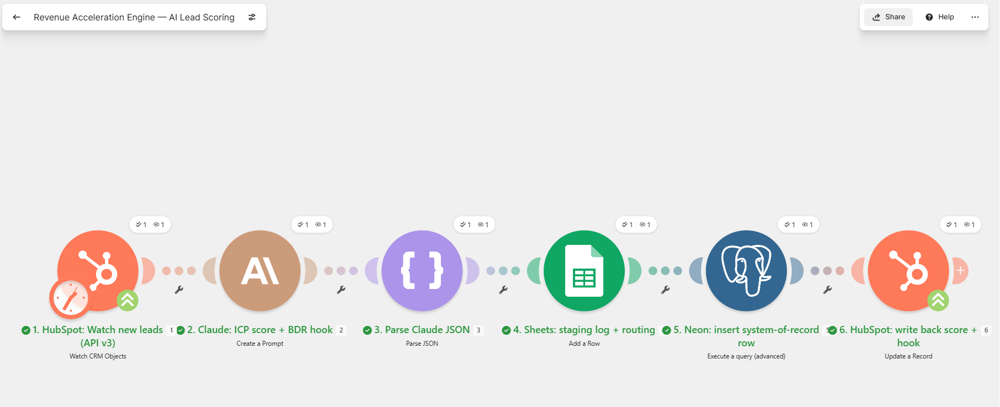
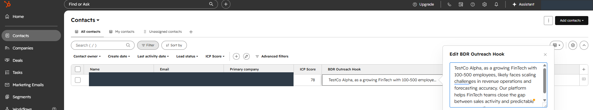

# Build Story - From Blueprint to Verified Pipeline

**Jernej Surc · July 2026.** This is the honest build log of the Revenue Acceleration Engine: what was designed on paper, what actually broke when it met real APIs, and how each defect was diagnosed and fixed. The debugging trail is the point - anyone can draw an architecture diagram; shipping means surviving contact with six vendors' schemas.

## The arc

1. **Phase 1 (database):** Neon PostgreSQL schema applied, 150 accounts + 248 deals seeded deterministically (`seed=42`), all three analytics queries verified non-empty and sensible.
2. **Data storytelling:** dataset anchored to a real fiscal timeline (Jan 2025 → FY26 Q2 close, snapshot 1 July 2026) with quarter-end close clustering - 66.7% of closes land in the final week of a quarter, the pattern every RevOps team recognizes from their own CRM.
3. **Phase 3 (automation):** the Make.com scenario was deployed via API, then smoke-tested live against HubSpot, the Claude API, Google Sheets, and Neon - one module at a time, fixing each failure until all six ran green.
4. **Verification:** a real contact flowed end-to-end - scored 85 by Claude, routed `BDR_PRIORITY`, logged to Sheets, inserted into Neon (`employee_count` correctly derived), and written back to HubSpot in one run.

## Defects the smoke test caught (that a paper design never would)

| # | Symptom | Root cause | Fix |
|---|---------|-----------|-----|
| 1 | Live DB credential in `.env.example` | Real Neon connection string in a committed example file | Redacted before first commit; password rotation advised |
| 2 | INSERT would break on apostrophes | Claude's prose interpolated raw into SQL | Double single-quotes via Make `replace()` at every text hop |
| 3 | Scenario wouldn't run: `hashId` TypeError | Polling trigger's cursor can only be initialized in the Make UI ("Choose where to start") - not via API | One-time UI initialization; documented |
| 4 | Trigger config empty in UI | Hand-written blueprint guessed the schema: `objectType: "contact"`, `watch` - real module wants `"contacts"`, `watchPattern`, and outputs `{{1.id}}` not `{{1.objectId}}` | Rebuilt module 1 from the live schema via Make's API |
| 5 | HubSpot rejected the test contact | Portal uses `numemployees` (default property), not `numberofemployees` - and it's an **enum of ranges** (`"100-500"`), not a number | Renamed in all three mappings; SQL converts range → lower bound for the integer column |
| 6 | Contact creation blocked: "limit of 1000" | ~1,000 bulk-deleted contacts in the recycle bin still counted against the free-tier cap (0 live contacts!) | Restored one contact, temporarily watched `updated` instead of `created` to fire the pipeline |
| 7 | Claude module: content shape rejected | Messages need `inputType: "single"` discriminator | Added; schema-verified |
| 8 | Claude module: "missing parameter model" | Make validates against the connection's model list - the `claude-haiku-4-5` alias isn't in it | Dated ID `claude-haiku-4-5-20251001` |
| 9 | JSON parse failed | Claude wrapped output in ```` ```json ```` fences despite instructions | Prompt hardened *and* regex fence-strip + trim before ParseJSON |
| 10 | Postgres module: "Command must not be empty" / "Connection empty" | This app names its SQL field `command` (not `query`) and its connection param `account` (not `__IMTCONN__`) | Remapped both from the live module schema |
| 11 | All green through module 5, but writeback never ran | INSERT returns no rows; "continue when no rows" defaulted to No, silently ending the route | Flag → Yes, plus `RETURNING lead_id` so the insert emits the new ID |

Also learned the hard way: a stale Make editor tab silently reverts API-pushed blueprints on save - after any API update, refresh before touching the UI.

## Proof of life

Final verified run (2026-07-10): HubSpot contact → Claude Haiku scored **85**, wrote a two-sentence personalized hook → routed **BDR_PRIORITY** → row staged in Google Sheets → inserted into Neon with `employee_count = 100` (from "100-500") and apostrophes intact → score, hook, and routing written back onto the HubSpot contact. Test data then cleaned up: Neon reseeded to exactly 150 accounts / 248 deals with the identical ARR fingerprint (€27,688,910.33), proving the deterministic dataset reproduces bit-for-bit.

The receipts, from a later verification run (Claude is non-deterministic, so each run scores and phrases slightly differently - this one landed at 78, still BDR_PRIORITY):





## Ops-budget reality check

Design said "~6 ops/lead ≈ 900 ops/month - fits the free tier." Reality: **every empty poll costs 1 op**, so a 15-minute schedule burns ~2,880 ops/month before processing a single lead. The deployed scenario polls every 2 hours (~360/month), leaving real headroom for lead processing. Free-tier architecture is a budget problem, not just a wiring problem.
