# Autonomous B2B Revenue Acceleration Engine

[](https://github.com/jernejsurc/revenue-intelligence-engine/actions/workflows/validate-data.yml)

An end-to-end commercial intelligence system built entirely on free tiers. Inbound leads are AI-scored and enriched in under a minute, routed by ICP fit, logged to a serverless SQL warehouse, and visualized in a live Power BI revenue dashboard.

**Built by Jernej Surc** - RevOps / GTM / Revenue Analytics. Demonstrates CRM architecture, workflow automation, production SQL, AI prompt engineering, and BI modeling in one working system.

## The five-minute tour

Evaluating this project? Walk it in this order - each stop is proof of a different skill:

| Stop | Where | What it demonstrates |
|---|---|---|
| 1 | [Business scenario](#business-scenario) | Commercial framing: a benchmark-calibrated B2B SaaS pipeline, not random demo rows |
| 2 | [Architecture](#architecture) → [Live run evidence](#live-run-evidence) | A six-vendor integration that actually ran: AI scored a lead and round-tripped the result into the CRM |
| 3 | [`analytics_queries.sql`](analytics_queries.sql) + the [Neon shot](#live-run-evidence) | Production SQL - CTEs, window functions, filtered aggregates - answering real pricing, KAM, and velocity questions |
| 4 | [Power BI dashboard](#power-bi-dashboard-3-pages) | BI modeling: snapshot-anchored DAX, every figure validated cell-by-cell against SQL |
| 5 | [`BUILD_STORY.md`](BUILD_STORY.md) | How I actually work: 11 real defects caught in live smoke testing, each diagnosed and fixed |

In a hurry? [`EXECUTIVE_SUMMARY.md`](EXECUTIVE_SUMMARY.md) is the 30-second version.

## Business scenario

The dataset models **Adriatic Analytics**, a fictional Ljubljana-based B2B SaaS vendor selling a pipeline-analytics platform to mid-market tech companies across ten verticals (FinTech, HealthTech, Cybersecurity, DevTools, and others). Pricing runs four tiers, from Starter (€6–18K ACV) to Enterprise (€150–480K ACV). The company moved its GTM tracking off spreadsheets and into HubSpot in **January 2025**; the warehouse holds every account and deal from then through the **FY26 Q2 close** (reporting snapshot: 1 July 2026) - 150 accounts and 248 deals over 18 months.

The mock data is calibrated to published B2B SaaS benchmarks so the analytics read like a genuine pipeline review:

- **Sales cycles average 82–101 days**, lengthening with company size - in line with the 2–3 month norm for mid-market ACV deals.
- **Late-stage win rates land in the 50–66% band** across tiers, and correlate with the AI's ICP score by construction.
- **Two-thirds of closes cluster in the final week of a fiscal quarter** - the classic rep-incentive pile-up every RevOps team will recognize.
- **~30% of Starter/Growth customers show high expansion intent** (health score >80) within their first year, feeding the KAM upsell queue.

Everything is deterministic (`seed=42`) and anchored to the fixed snapshot date, so every reseed reproduces the exact numbers quoted here.

## Architecture

Make.com orchestrates every hop (~6 ops/lead):

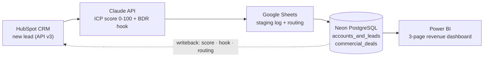

Total cost: **€0/month** (HubSpot Free, Make.com 1,000 ops, Neon free serverless, Google Sheets, Power BI Desktop).

### Data model

Two tables, one relationship - the AI enrichment lands on the account, the money lands on the deal:

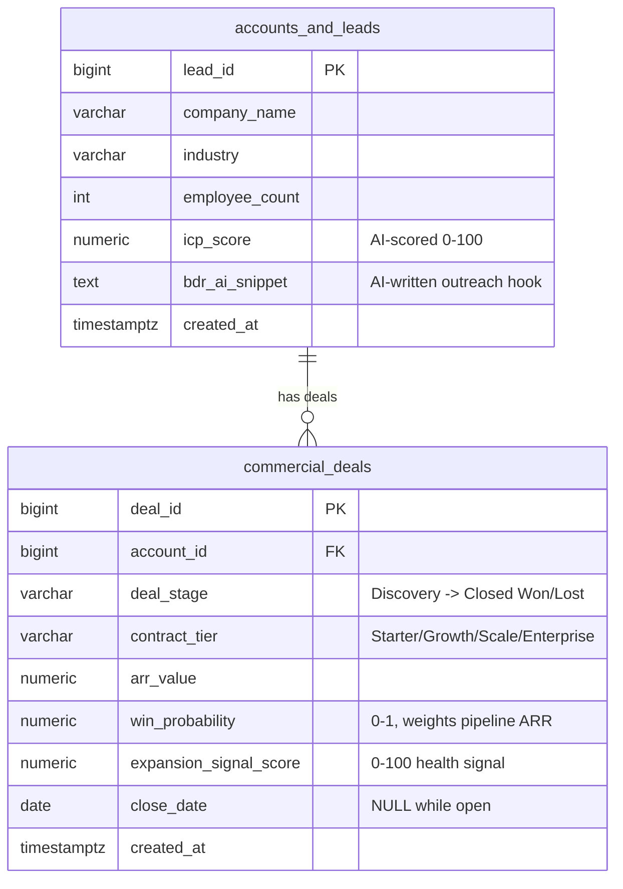

Four analytics queries read this model: **A** pipeline velocity, **B** KAM expansion readiness, **C** win-rate elasticity, **D** ICP score validation - and the CI badge above proves all of it reproduces: every push spins up a fresh PostgreSQL container, applies the schema, reseeds, and asserts 12 known fingerprints (row counts, the ARR total to the cent, and each query's key results).

## What it does

Automates lead enrichment with AI (Claude assigns every inbound lead an ICP score and writes a personalized outreach hook, written back to HubSpot so BDRs never touch unscored leads). Ranks expansion opportunities (SQL identifies Closed Won accounts on lower tiers with health scores >80 and ranks them by weighted ARR upside - a Monday-morning upsell queue for KAMs). Measures what matters (pipeline velocity by segment, win-rate elasticity by tier and deal size, weighted pipeline ARR, and whether the AI's ICP scores actually predict revenue).

## Repository

| File | Purpose |
|---|---|
| `schema.sql` | PostgreSQL DDL - 2 tables, constraints, analytics indexes |
| `seed_data.py` | psycopg v3 seed script - 150 accounts + 248 deals, Jan 2025 → Jul 2026, quarter-end close clustering |
| `analytics_queries.sql` | Query A: pipeline velocity · B: KAM expansion readiness · C: win-rate elasticity · D: ICP score validation |
| `scripts/validate_pipeline.py` | CI guardrail - reseeds and asserts 12 dataset/query fingerprints |
| `.github/workflows/validate-data.yml` | GitHub Action: fresh Postgres container → schema → seed → assert, on every push |
| `make_payload_template.json` | Exact JSON contract at every Make.com hop |
| `make_scenario_blueprint.json` | Importable Make.com scenario blueprint (validated against Make's schema) |
| `powerbi_measures.dax` | Weighted Pipeline ARR, Avg Days to Close, Expansion Readiness Index, ICP Conversion %, snapshot-anchored open-pipeline aging |
| `adriatic_theme.json` | Power BI report theme (View → Themes → Browse) |
| `EXECUTIVE_SUMMARY.md` | One-page project brief for recruiters & hiring managers |
| `BUILD_STORY.md` | Honest build log: 11 real defects the live smoke test caught, and the fixes |
| `CLAUDE.md` | Project guidelines for Claude Code |

## Quick start

```bash
pip install -r requirements.txt
cp .env.example .env               # add your Neon DATABASE_URL (sslmode=require)
psql "$DATABASE_URL" -f schema.sql
python seed_data.py                # 150 accounts, ~250 deals, seed=42
psql "$DATABASE_URL" -f analytics_queries.sql
```

## Make.com scenario setup (6 modules, free tier)

**Fast path:** in Make, create a new scenario → ⋯ menu → *Import Blueprint* → upload `make_scenario_blueprint.json`, then link your HubSpot, Anthropic, Google Sheets, and PostgreSQL (Neon) connections. The flow:

1. **HubSpot > Watch CRM Objects** (`hubspotcrm:WatchCRMObjects`) - trigger on new contact (API v3).
2. **Anthropic Claude > Create a Prompt** (`anthropic-claude:createAMessage`) - system prompt forces JSON output: `{"icp_score": <0-100>, "bdr_snippet": "<2 sentences>"}` (see `make_payload_template.json`).
3. **JSON > Parse JSON** - validate Claude's response.
4. **Google Sheets > Add a Row** (`google-sheets:addRow`) - staging log; routing computed inline: ICP ≥ 75 → BDR_PRIORITY, 50–74 → NURTURE, else DISQUALIFY (swap in a Router module if you prefer visual branching).
5. **PostgreSQL > Execute a Query** (`postgres:Query`) - insert into Neon `accounts_and_leads` (SSL).
6. **HubSpot > Update a Record** (`hubspotcrm:UpdateRecord`) - write score, hook, and routing back to the lead.

Budget: ~6 ops/lead → ~150 leads/month inside the 1,000-op free tier. Note that every scheduled poll costs 1 op even with no new leads - at a 2-hour interval that's ~360 ops/month of polling; a 15-minute interval (~2,880/month) blows the free tier on its own.

**Deployment notes (from the live build):**

- Create the three custom contact properties in HubSpot **before** activating: `icp_score` (number), `bdr_outreach_hook` (multi-line text), `lead_routing` (dropdown: BDR_PRIORITY / NURTURE / DISQUALIFY).
- HubSpot's default contact property for company size is `numemployees` - an enumeration of ranges (`"100-500"`), not a number. The blueprint converts it to the range's lower bound for the integer `employee_count` column.
- The PostgreSQL connection needs **Encrypt = Yes** (Neon refuses non-SSL) and the module's *"Continue the execution even if no rows"* = Yes, or the route stops after the INSERT and the writeback never runs.
- Use a dated Claude model ID (`claude-haiku-4-5-20251001`) - Make validates against the connection's model list, which doesn't include aliases.
- After import, open module 1 once and set **"Choose where to start"** - a polling trigger can't run until its cursor is initialized (this must be done in the UI).

### Live run evidence

> All contact records in these screenshots are **synthetic demo data** - names, emails, and companies are fictitious.

All six modules green on a real run - one operation each, end to end:


The Claude scoring module: ICP system prompt with an enforced JSON contract, and live HubSpot field mapping (no hardcoded inputs):

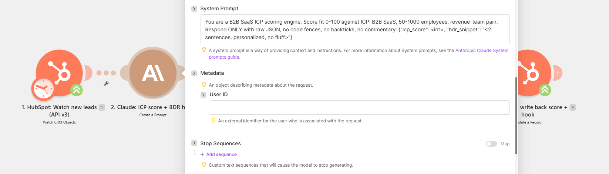

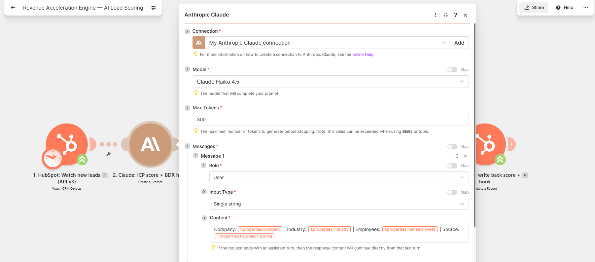

The round trip back into the CRM - the AI's score, outreach hook, and routing decision written onto the contact record:

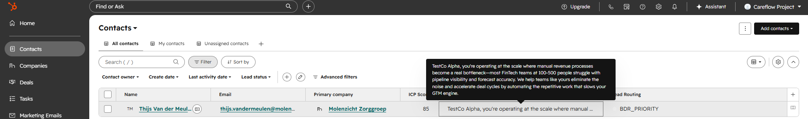

Every scored lead is also appended to the Google Sheets staging log with its routing decision - the ops-friendly audit trail between the CRM and the warehouse:

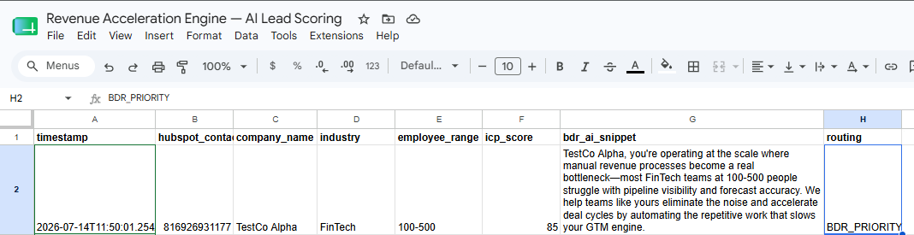

And the warehouse end of the pipe: Query B (KAM expansion readiness) running live in Neon's SQL editor - 22 ranked upsell candidates in 160 ms:

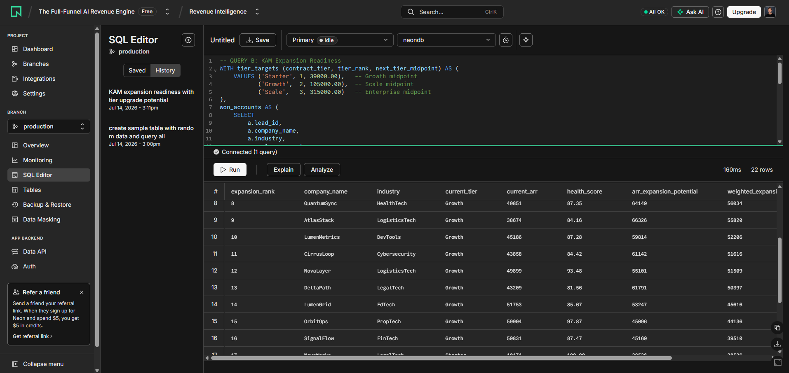

## Power BI dashboard (3 pages)

Built in Power BI Desktop (Import mode against Neon), styled with the included `adriatic_theme.json`, and validated cell-by-cell against SQL - every number below reproduces exactly on a reseed. Full model in `Intell Engine PowerBI.pbix`.

### 1. Pipeline Command Center
KPI cards (Weighted Pipeline ARR €15.3M, win rate 56.9%, 89.7-day avg cycle), deal funnel by stage, and sales-cycle length by company size - the "bigger closes slower" story in one glance (Query A).

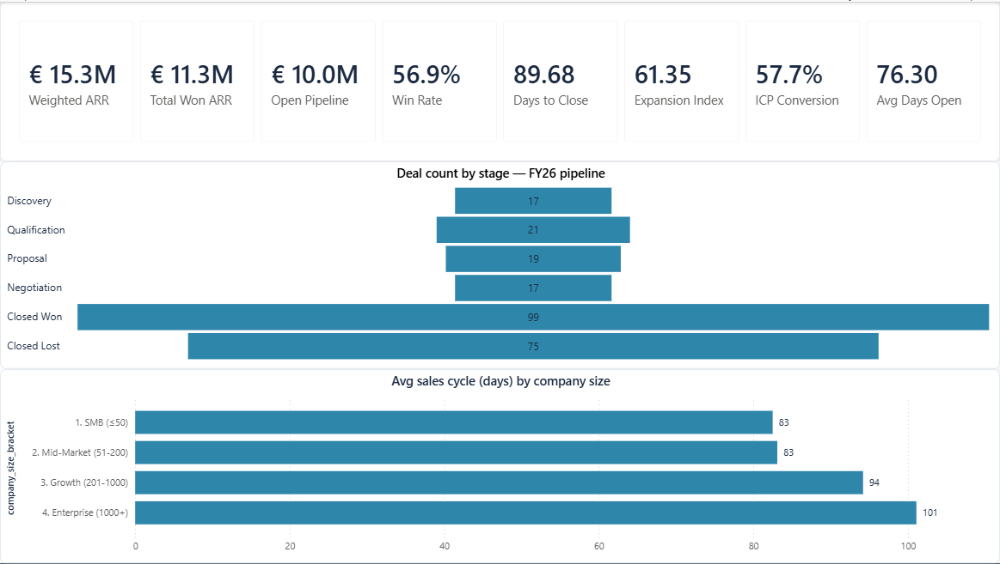

### 2. KAM Expansion Radar
Expansion Readiness Index gauge (61.4 vs target 60) and the ranked Monday-morning upsell queue: 22 upgrade-ready accounts sorted by weighted ARR upside (Query B).

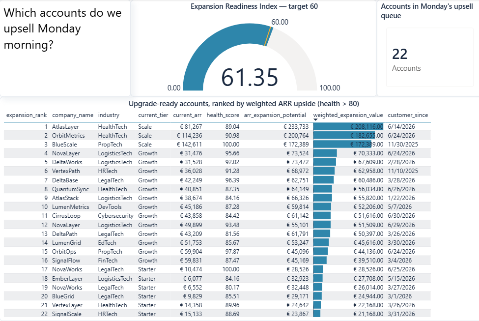

### 3. Pricing & Win-Rate Elasticity
Win-rate heat matrix by tier × deal size, won-vs-lost volumes per tier, and the ICP Conversion card (57.7%) proving the AI's scores predict revenue (Query C).

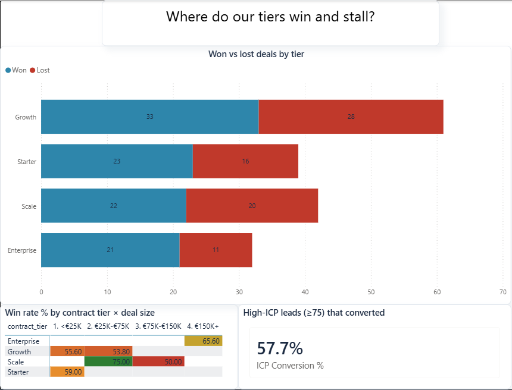

## Does the AI score actually predict revenue?

Trust, but verify: Query D groups every closed deal by the account's AI-assigned ICP band - using the same thresholds the routing runs on - and checks whether higher scores actually win more.

| ICP band | Closed deals | Won | Win rate | Lift vs. overall |
|---|---|---|---|---|
| <50 (disqualify) | 31 | 10 | 32.3% | 0.57× |
| 50-74 (nurture) | 84 | 50 | 59.5% | 1.05× |
| 75+ (BDR priority) | 59 | 39 | 66.1% | 1.16× |

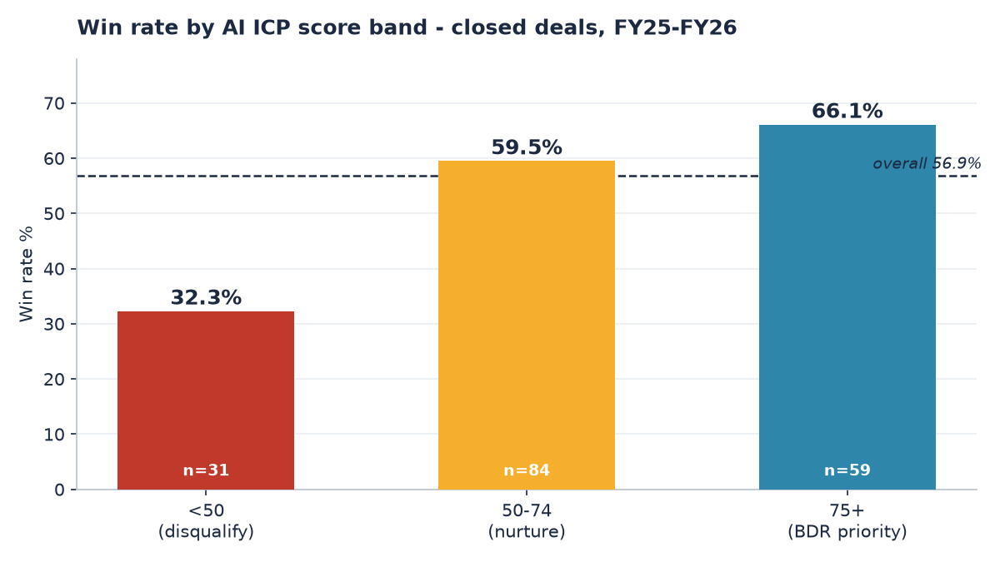

The signal is monotonic: deals the AI routes to BDR priority close at **2× the rate** of the band it disqualifies. That's the difference between "we bought an AI" and "our AI provably concentrates rep time where revenue is" - and it's exactly the audit a revenue leader should demand before trusting any scoring model.
